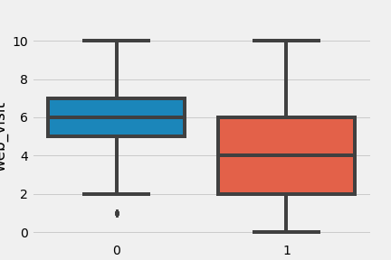
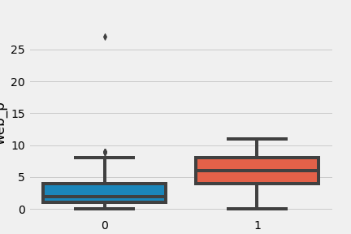

# [Campaign Success Calculator](https://campaign-calculator.herokuapp.com/) 
[(the code)](https://github.com/indzhov/Campaign-Success-Calculator-ML/blob/main/Final.ipynb) 

This is my final project for the Machine Learning course, provided by SoftUni Bulgaria. It is trying to build an web app, which is able to show us the outcome from a campaign even before we start to invest money in it. 

The project is also motivated from [this article](https://blog.hubspot.com/marketing/buyer-persona-research) which teach us how to attach a buyer persona to our clients and in that way to "understand our customers (and prospective customers) better". The publication also deals with the "good" and "bad" persona and how to make a difference between them. In the project I am doing it through the Scientific Method, however in the article they explains it as follows : 

"While a buyer persona is a representation of your ideal customer, a negative — or "exclusionary” — persona is a representation of who you don’t want as a customer.

For example, this could include professionals who are too advanced for your product or service, students who are only engaging with your content for research/ knowledge, or potential customers who are just too expensive to acquire (because of a low average sale price, their propensity to churn, or their unlikeliness to purchase again from your company)."

In our case one of the Persona for example visit our website most, but do not make a purchase from it. So, there is no point to target it in the next campaign.

The main objective from the author of [the dataset](https://www.kaggle.com/rodsaldanha/arketing-campaign) we are using is to train a predictive model which allows the company to maximize the profit of the next marketing campaign. My project does exactly that. It includes Unsupervised and Supervised learning. With the first one, I found out the perfect clustering of the clients and give them a persona, the next one train a model to predict a future client, and in which persona might be. Thus, we can use some of the features and the provided information about the previous campaigns to see, which one have most impact to the final outcome. More than that, we can see the difference and target the good persona, which is willing to take an offer more than the bad persona in the first campaigns.
